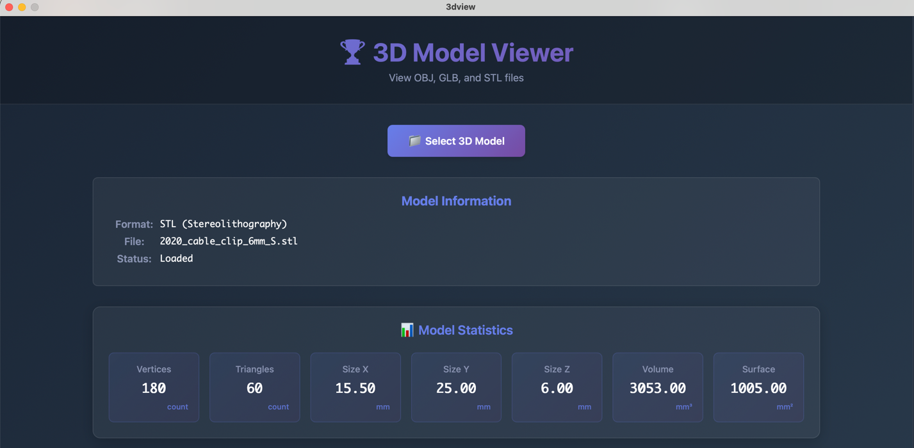
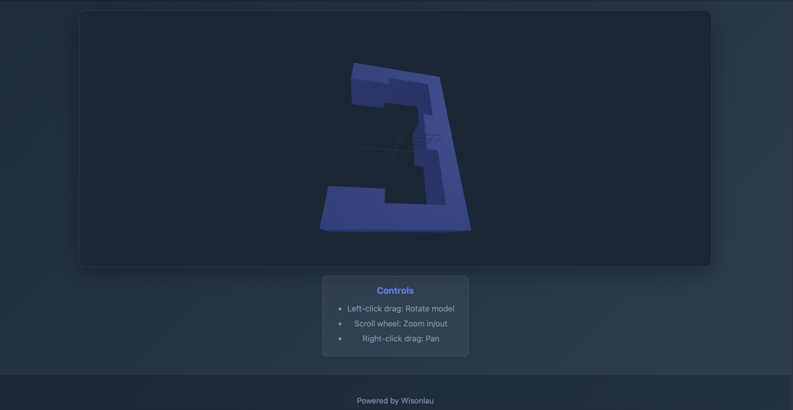

# 3D Model Viewer 🏆

A powerful 3D model viewer built with Wails and Three.js, supporting OBJ, GLB/GLTF, and STL file formats.



## ✅ Recent Fixes

- **Fixed STL file loading**: STL files now correctly load using ArrayBuffer instead of text
- **Improved error handling**: Better error messages and logging for troubleshooting
- **Enhanced file validation**: Proper format checking before attempting to load

## Features

- 🎨 **Modern UI**: Beautiful interface built with React and Vite
- 🖱️ **Interactive Controls**: Rotate, zoom, and pan with mouse
- 🚀 **High Performance**: WebGL-accelerated rendering
- 📦 **Cross-Platform**: Supports macOS, Windows, and Linux
- 🌐 **Multiple Formats**: OBJ, GLB/GLTF, and STL support
- 🔧 **Robust Loading**: Proper handling of binary and text file formats
- 📊 **Model Statistics**: Real-time calculation of vertices, triangles, dimensions, volume, and surface area

## Tech Stack

- **Backend**: Go + Wails
- **Frontend**: React + Vite + Three.js
- **3D Rendering**: Three.js (WebGL) with ES6 modules
- **File Parsing**: Trophy library
- **Build System**: Vite (optimized bundling)

### Three.js Architecture
- Core library and loaders imported as npm modules
- No CDN dependencies - ensures version compatibility
- Optimized bundle size with gzip compression (~191 KiB)
- Real-time geometry analysis and statistics calculation

## Prerequisites

- Go 1.25 or higher
- Node.js 18 or higher
- Wails CLI v2.11.0

## Installation

1. Install Wails CLI:
```bash
go install github.com/wailsapp/wails/v2/cmd/wails@latest
```

2. Navigate to the project directory and install frontend dependencies:
```bash
cd frontend
npm install
```

## Running

### Development Mode

```bash
wails dev
```

This will start a development server with hot reload support.

### Production Build

```bash
wails build
```

The built application will be in the `build/bin/` directory.

### Quick Start Scripts

```bash
# macOS/Linux
./start.sh

# Windows
start.bat
```

## Usage

1. Launch the application
2. Click "📁 Select 3D Model" button
3. Choose a 3D model file (.obj, .glb, .gltf, .stl)
4. The model will be automatically loaded and displayed

### Controls

- **Left-click drag**: Rotate the model
- **Scroll wheel**: Zoom in/out
- **Right-click drag**: Pan the view

## Supported File Formats

| Format | Extension | Notes |
|--------|-----------|-------|
| OBJ | .obj | Wavefront OBJ (text format) |
| GLB | .glb | Binary glTF with embedded textures |
| GLTF | .gltf | JSON glTF format |
| STL | .stl | Stereolithography (binary/ASCII) ✅ **Fixed** |

## Project Structure

```
3dview/
├── app.go                 # Go backend main application
├── main.go               # Wails entry point
├── wails.json            # Wails configuration
├── README.md             # This file
├── README_CN.md          # Chinese documentation
├── USAGE.md              # Detailed usage guide
├── TROUBLESHOOTING.md    # Troubleshooting guide
├── PROJECT_SUMMARY.md    # Project summary
├── start.sh              # macOS/Linux startup script
├── start.bat             # Windows startup script
├── build.sh              # Build script
├── frontend/
│   ├── src/
│   │   ├── App.jsx       # React main component
│   │   ├── App.css       # Application styles
│   │   └── main.jsx      # React entry
│   ├── index.html        # HTML template
│   └── package.json      # Frontend dependencies
└── build/                # Build output
```

## Development

### Adding New 3D Format Support

1. Add the new format in `getFileFormat` method in `app.go`
2. Add the corresponding loader in `loadThreeJSModel` method in `frontend/src/App.jsx`
3. Determine if the format requires ArrayBuffer or text reading
4. Update the file selector's `accept` attribute

### Customizing Styles

Edit `frontend/src/App.css` to customize the application's appearance.

## Troubleshooting

If you encounter issues:
1. Check the [TROUBLESHOOTING.md](TROUBLESHOOTING.md) guide
2. Verify your file format is supported
3. Check browser console for detailed error messages
4. Ensure you're using the latest build

## License

MIT License

## Credits

- [Wails](https://wails.io/) - Go framework for building desktop apps
- [Three.js](https://threejs.org/) - 3D web rendering library
- [Trophy](https://github.com/taigrr/trophy) - 3D model parsing library

## Version History

### v1.0.4 (2026-04-16)
- ✅ Added detailed model statistics panel with units
- ✅ Real-time calculation of vertices, triangles, dimensions
- ✅ Volume and surface area calculations for loaded models
- ✅ Improved statistics display with visual card layout

### v1.0.3 (2026-04-15)
- ✅ Fixed WebGL context conflict when loading multiple files
- ✅ Implemented complete object cleanup and memory management
- ✅ Added canvas replacement strategy to avoid context conflicts
- ✅ Support for continuous loading of multiple models without errors

### v1.0.2 (2026-04-15)
- ✅ Fixed STLLoader constructor error
- ✅ Migrated from CDN to npm modules for Three.js
- ✅ Improved bundle optimization with Vite
- ✅ Enhanced version compatibility and reliability

### v1.0.1 (2026-04-15)
- Fixed STL file loading issue
- Improved error handling and logging
- Better file format validation

### v1.0.0 (2026-04-15)
- Initial release
- Basic 3D model viewing functionality
- Support for OBJ, GLB, GLTF, and STL formats
